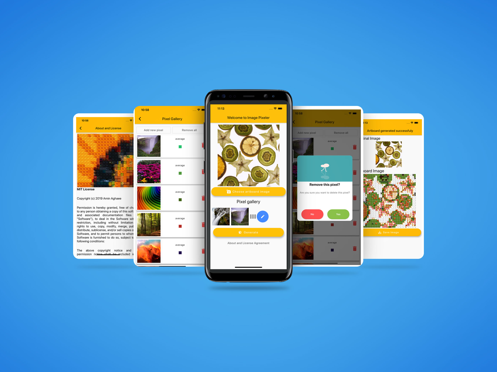
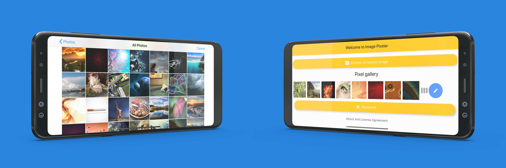

# ImagePixelerApps
This is the repository for iOS, Android and Web applications version of **Image-Pixeler** which is developed using Flutter development kit and Dart language.

## What is Image-Pixeler
Image Pixeler is a platform to replace pixels, or group of pixels in an image, with other images. The initial idea was developed in Python. Details about the core engine is available at Image-Pixeler's github repository [here](https://github.com/aminrd/Image-Pixeler/). In this project, the main idea is expanded into iOS, Android and Web Applicatinos.

## What is Flutter
**Flutter** is an open-source UI software development kit created by Google. It is used to develop applications for Android, iOS, Windows, Mac, Linux, Google Fuchsia and the web. Flutter apps are written in the **Dart** language and make use of many of the language's more advanced features.

## Showcases

Image Pixeler is developed with Dart programming language using Flutter framework. That means user can run Image Pixeler on iOS and Android devices while experiencing high performance on mobile devices possible. Image Pixeler is also responsive to different devices sizes working in both portrait and landscape modes.

## Author
* [**Amin Aghaee**](https://github.com/aminrd/)
